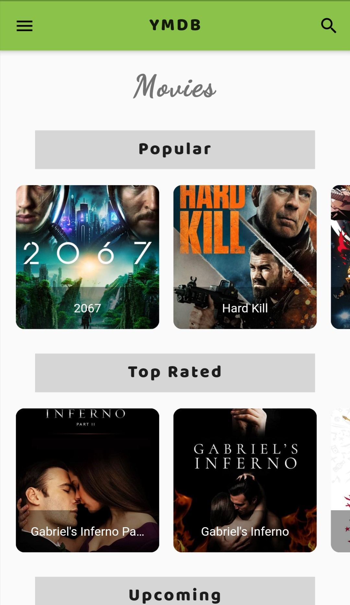
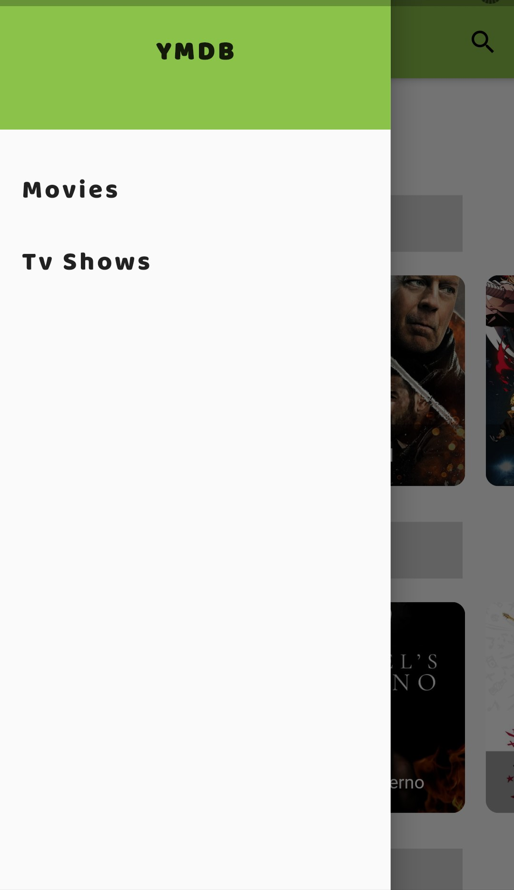
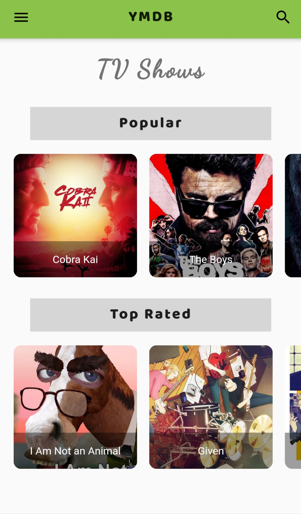
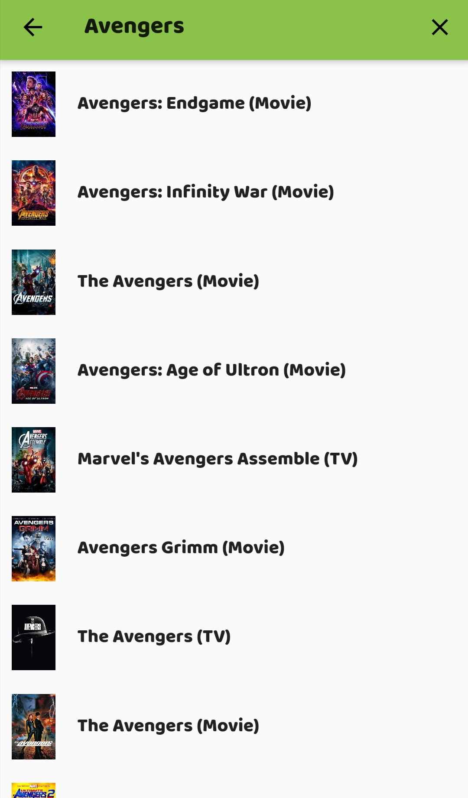
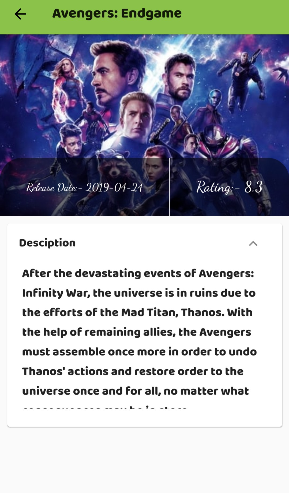
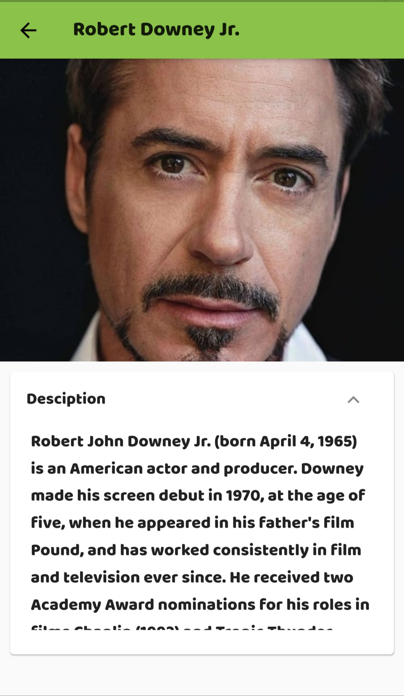

# ymdb

YMDB

## Getting Started

A mobile application in which user can search for movies, Tv Shows and People.
This application is built using Flutter and its provider architecture.
<table>
  <tr>
     <td>Movies Home</td>
     <td>Drawer</td>
     <td>Tv Home</td>
  </tr>
  <tr>
    <td valign="top"></td>
    <td valign="top"></td>
    <td valign="top"></td>
  </tr>
  <tr>
     <td>Search</td>
     <td>Movie Detail Page</td>
     <td>Person Detail Page</td>
  </tr>
  <tr>
    <td valign="top"></td>
    <td valign="top"></td>
    <td valign="top"></td>
  </tr>
 </table>
